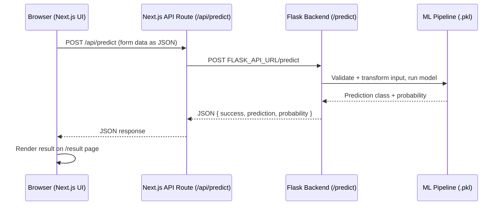
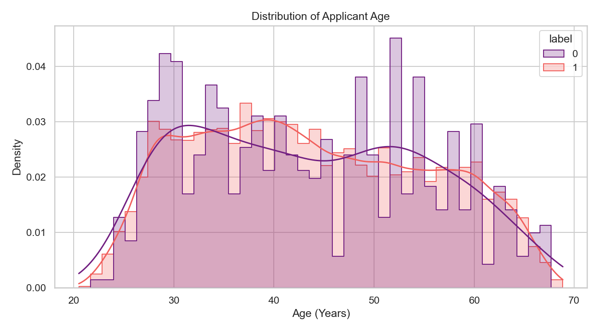
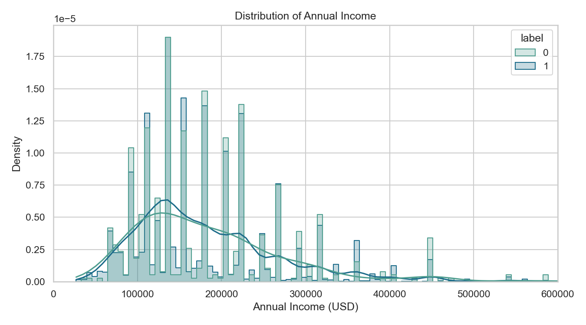

<div align="center">


<br/>

[](LICENSE)
[](https://github.com/RevanthBoina/Credit-card-Auto-Approval-prediction/stargazers)
[](https://github.com/RevanthBoina/Credit-card-Auto-Approval-prediction/network/members)
[](https://github.com/RevanthBoina/Credit-card-Auto-Approval-prediction/issues)
[](https://github.com/RevanthBoina/Credit-card-Auto-Approval-prediction/commits/main)
[](#-contributing)

<a href="https://credit-card-auto-approval-predictio.vercel.app/" target="_blank">
  
</a>

<br/><br/>


</div>

<br/>

> **CardApprove AI** predicts credit card approval outcomes in real time using a trained Logistic Regression pipeline — served through a clean, decoupled **Next.js frontend + Flask API backend** architecture. No manual scoring, no black-box guesswork — just a fast, explainable prediction with a confidence score.

---

## 📑 Table of Contents

<details open>
<summary>Click to expand</summary>

- [Why CardApprove AI?](#-why-cardapprove-ai)
- [Key Features](#-key-features)
- [Tech Stack](#-tech-stack)
- [Architecture](#-architecture)
- [Project Structure](#-project-structure)
- [Quick Start](#-quick-start)
- [Environment Variables](#-environment-variables)
- [Deployment](#-deployment)
- [API Reference](#-api-reference)
- [Machine Learning Pipeline](#-machine-learning-pipeline)
- [Performance Metrics](#-performance-metrics)
- [Roadmap](#-roadmap)
- [Contributing](#-contributing)
- [FAQ](#-faq)
- [Star History](#-star-history)
- [License](#-license)

</details>

---

## 💡 Why CardApprove AI?

Traditional credit scoring is slow, manual, and prone to human bias. **CardApprove AI** replaces that with a trained ML pipeline that scores applicants instantly and transparently — returning not just a decision, but the probability behind it.

The project is built the way production ML apps actually ship: **a UI layer and a model-serving layer, deployed and scaled independently.**

|  | Before | Now |
| :--- | :--- | :--- |
| **UI** | Server-rendered Jinja templates | Modern Next.js + React frontend |
| **Backend** | Flask rendering HTML | Flask as a pure JSON API |
| **Coupling** | One monolithic app | Two independently deployable services |
| **Contract** | Implicit (HTML forms) | Explicit, documented JSON API |

---

## ✨ Key Features

- 🚀 **Real-time Scoring Engine** — instant predictions over a JSON API
- 🧠 **Trained Logistic Regression Pipeline** — 85%+ accuracy
- 🔍 **Explainable Output** — returns class **and** approval probability, not just a verdict
- 🧩 **Decoupled Architecture** — Next.js frontend and Flask backend deploy, scale, and evolve independently
- 🔐 **Server-side Proxying** — the browser never talks to the ML backend directly
- 🛡️ **Client-side Fallback** — prediction engine works even when backend is unavailable
- 🖥️ **Beginner-friendly Setup** — two terminals, two commands, done

---

## 🛠️ Tech Stack

<div align="center">

| Layer | Stack |
| :--- | :--- |
| **Frontend** | Next.js 16 · React 19 · TypeScript · Tailwind CSS |
| **Backend** | Flask · Python 3.9+ |
| **ML / Data** | Scikit-Learn · Pandas · NumPy · Joblib |
| **Deployment** | Vercel (frontend) · Render / Railway / Fly.io (backend) |

</div>

---

## 🏗️ Architecture

```
User
  │
  ▼
Next.js Frontend  (client/app/)
  │  fetch → same-origin, relative path
  ▼
Next.js API Route  (client/app/api/predict/route.ts)
  │  server-to-server fetch → FLASK_API_URL
  ▼
Flask Backend  (server/web/app.py) — POST /predict
  │
  ▼
Trained ML Pipeline  (server/web/models/credit_approval_model.pkl)
  │  predict() + predict_proba()
  ▼
Prediction Response  (JSON: prediction, prediction_label, probability)
  │
  ▼
Frontend Result UI  (client/app/result/page.tsx)
```

**Why the proxy route exists:** the browser never calls Flask directly. It calls the same-origin `/api/predict` route, which forwards the request to Flask server-side via `FLASK_API_URL`. Zero CORS config, zero backend URL leaked to client code.



---

## 📂 Project Structure

```
├── client/                          # Next.js frontend (App Router)
│   ├── app/                       # Pages and routes
│   │   ├── api/predict/route.ts   # Server-side proxy to the Flask backend
│   │   ├── page.tsx               # Landing page
│   │   ├── predict/page.tsx       # Prediction form page
│   │   ├── result/page.tsx        # Prediction result page
│   │   └── about/page.tsx         # About page
│   ├── components/               # Shared React UI components
│   │   ├── predict-form.tsx       # Form + real API call to /api/predict
│   │   ├── result-card.tsx        # Renders the prediction result
│   │   ├── navbar.tsx             # Navigation header
│   │   └── ui/                    # UI primitives (shadcn-style)
│   ├── lib/                      # Shared utilities
│   │   ├── prediction-engine.ts   # Client-side fallback prediction
│   │   └── utils.ts               # Tailwind class merge helper
│   ├── package.json              # Next.js project config
│   ├── tsconfig.json             # TypeScript configuration
│   ├── next.config.mjs           # Next.js config
│   └── .env.example              # Frontend env vars (FLASK_API_URL)
├── server/                         # Flask backend (API-only)
│   └── web/
│       ├── app.py                # Flask API: GET /health, POST /predict
│       ├── train_model.py        # Model training script
│       ├── requirements.txt      # Python dependency declarations
│       ├── .env.example          # Backend runtime env vars
│       ├── models/
│       │   └── credit_approval_model.pkl  # Trained pipeline (not committed)
│       └── static/img/           # EDA plots
├── LICENSE                         # MIT License
└── README.md                       # This file
```

> **Note:** `server/web/models/credit_approval_model.pkl` is excluded from git via `.gitignore` (large binary). Run `python server/web/train_model.py` to generate it, or provide your own.

---

## ⚡ Quick Start

### Prerequisites

```bash
node --version      # 18+
python3 --version   # 3.9+
```

### 1. Clone

```bash
git clone https://github.com/RevanthBoina/Credit-card-Auto-Approval-prediction.git
cd Credit-card-Auto-Approval-prediction
```

### 2. Backend — Flask API

```bash
cd server/web
python3 -m venv .venv && source .venv/bin/activate
pip install --upgrade pip && pip install -r requirements.txt

# place the trained pipeline at server/web/models/credit_approval_model.pkl
# or generate it by running:
python train_model.py

cp .env.example .env
python app.py
```

Runs on **http://127.0.0.1:8080** — verify with:

```bash
curl http://127.0.0.1:8080/health
```

### 3. Frontend — Next.js (new terminal, from repo root)

```bash
cd client
pnpm install
cp .env.example .env.local     # set FLASK_API_URL=http://127.0.0.1:8080
pnpm dev
```

Open **http://localhost:3000** 🎉

### 4. Running both together

| Terminal | Command | Runs on |
| :--- | :--- | :--- |
| 1 — Backend | `cd server/web && python app.py` | `http://127.0.0.1:8080` |
| 2 — Frontend | `cd client && pnpm dev` | `http://localhost:3000` |

Both must be running — the frontend's `/api/predict` route forwards live requests to `FLASK_API_URL`.

---

## 🔑 Environment Variables

| Variable | Used by | Example | Description |
| :--- | :--- | :--- | :--- |
| `FLASK_API_URL` | Next.js (`client/app/api/predict/route.ts`) | `http://127.0.0.1:8080` | Base URL of the deployed Flask backend. Server-side only — never exposed to the browser. |
| `FLASK_DEBUG` | Flask (`server/web/app.py`) | `false` | Flask debug mode. Keep `false` in production. |
| `FLASK_PORT` | Flask (`server/web/app.py`) | `8080` | Port the Flask API listens on. |
| `FLASK_HOST` | Flask (`server/web/app.py`) | `0.0.0.0` | Host/interface Flask binds to. |
| `LOG_LEVEL` | Flask (`server/web/app.py`) | `INFO` | Python logging level for the API. |

Example files are committed for both sides: `client/.env.example` (Next.js) and `server/web/.env.example` (Flask).

### Setting `FLASK_API_URL` on Vercel

1. Deploy the Flask backend first (see [Deployment](#-deployment)) and note its public URL.
2. Vercel dashboard → your project → **Settings → Environment Variables**.
3. Add `FLASK_API_URL` = your backend URL, e.g. `https://your-flask-app.onrender.com`.
4. **Redeploy.** Environment variable changes never apply retroactively — you must trigger a new deployment.

---

## 🚀 Deployment

This project ships as **two independently deployed services**:

| Service | What | Where |
| :--- | :--- | :--- |
| **Frontend** | Next.js app (`client/`) | Vercel |
| **Backend** | Flask API (`server/web/`) | A Python-friendly host — **not Vercel** |

Vercel's serverless runtime isn't built for a long-running Flask process with a loaded scikit-learn model. **Vercel hosts the frontend only.** Deploy the Flask backend on:

- [Render](https://render.com/) · [Railway](https://railway.app/) · [Fly.io](https://fly.io/) · AWS (EC2 / Elastic Beanstalk)

**Steps:**
1. Deploy `server/web/` to your chosen Python host — make sure `credit_approval_model.pkl` is present in that deployment (it's git-ignored, so upload/bake it in separately).
2. Verify: `curl https://<your-backend-host>/health`
3. Set `FLASK_API_URL` on Vercel to that URL and redeploy the frontend.

---

## 📡 API Reference

Flask is JSON-only — no HTML routes remain on the backend.

### `GET /health`

<table>
<tr><td><b>200 — ready</b></td><td>

```json
{ "success": true, "status": "ok", "model_loaded": true }
```

</td></tr>
<tr><td><b>503 — not ready</b></td><td>

```json
{ "success": false, "status": "degraded", "model_loaded": false, "detail": "Model file not found at ..." }
```

</td></tr>
</table>

### `POST /predict`

**Request** — `Content-Type: application/json`

```json
{
  "Age": 35,
  "Gender": "Male",
  "Married": "Yes",
  "Income": 50000,
  "Debt": 5000,
  "YearsEmployed": 5,
  "Employed": "Yes",
  "BankCustomer": "Yes",
  "PriorDefault": "No",
  "EducationLevel": "bachelors",
  "Ethnicity": "white",
  "DriversLicense": "Yes",
  "Citizen": "by birth"
}
```

<table>
<tr><td><b>200 — success</b></td><td>

```json
{ "success": true, "prediction": 1, "prediction_label": "Approved", "probability": 0.87 }
```

</td></tr>
<tr><td><b>422 — validation error</b></td><td>

```json
{ "success": false, "error": "Invalid input data" }
```

</td></tr>
<tr><td><b>500 / 503 — server/model error</b></td><td>

```json
{ "success": false, "error": "Prediction failed due to an internal error." }
```

</td></tr>
</table>

The frontend never calls this directly from the browser — it goes through `client/app/api/predict/route.ts`, forwarding the same shape server-to-server.

---

## 🧠 Machine Learning Pipeline

```
Applicant Data ──► StandardScaler ──► Label Encoding ──► LogisticRegression
```

Credit scoring is treated as a **binary classification** problem. Numerical attributes are scaled, categorical attributes are label-encoded, and predictions return a class (`1` = Approved, `0` = Rejected) plus the model's confidence probability.

---

## 📊 Performance Metrics

<div align="center">

| Classifier | Accuracy | F1-Score | Status |
| :--- | :---: | :---: | :--- |
| 🏆 **Logistic Regression** | **85%+** | **0.85** | **Selected Model** |
| Rule-based Engine | N/A | N/A | Client-side fallback |

</div>

**EDA visuals** (`server/web/static/img/`):

<div align="center">


</div>

---

## 🗺️ Roadmap

- [x] Split monolithic Flask app into Next.js frontend + Flask JSON API
- [x] Server-side `/api/predict` proxy (no direct browser → Flask calls)
- [ ] Dockerize the Flask backend for one-command deployment
- [ ] Add automated tests for `/predict` validation logic
- [ ] Model explainability (SHAP values) surfaced in the result UI
- [ ] CI pipeline for lint + type-check + backend tests

Have an idea? Open an issue — contributions below 👇

---

## 🤝 Contributing

Contributions are welcome and appreciated!

1. Fork the repo
2. Create a branch: `git checkout -b feature/your-feature`
3. Commit your changes: `git commit -m "feat: add your feature"`
4. Push: `git push origin feature/your-feature`
5. Open a Pull Request

Please keep PRs focused and beginner-friendly — clear commit messages, no unrelated refactors.

---

## ❓ FAQ

<details>
<summary><b>Frontend shows "Could not reach the prediction backend"</b></summary>
<code>FLASK_API_URL</code> is unset, wrong, or Flask isn't running/reachable. Locally: <code>curl $FLASK_API_URL/health</code>. On Vercel: check the env var is set and redeploy.
</details>

<details>
<summary><b>Port already in use (Flask)?</b></summary>
<pre>FLASK_PORT=8081 python app.py</pre>
</details>

<details>
<summary><b>ModuleNotFoundError: No module named 'joblib'?</b></summary>
<pre>pip install -r requirements.txt</pre>
Make sure your virtual environment is activated.
</details>

<details>
<summary><b>GET /health returns 503</b></summary>
The model file is missing. Generate it by running <code>python train_model.py</code> in <code>server/web/</code> — it's git-ignored, so it must be added manually or included in your deployment separately.
</details>

---

## ⭐ Star History

<div align="center">
<a href="https://star-history.com/#RevanthBoina/Credit-card-Auto-Approval-prediction&Date">
  
</a>
</div>

If this project helped you, consider giving it a ⭐ — it genuinely helps!

---

## 📄 License

Distributed under the MIT License. See [`LICENSE`](LICENSE) for details.

---


[](https://github.com/RevanthBoina)


</div>
# Updated by script
# Updated by Prudhvi
# Finalized by Jayram
# Update by Renuka 1
# Update by Renuka 2
# Update by Renuka 3
# Update by Prudhvi 1
# Update by Prudhvi 2
# Update by Prudhvi 3
# Update by Jayram 1
# Update by Jayram 2
# Update by Jayram 3
