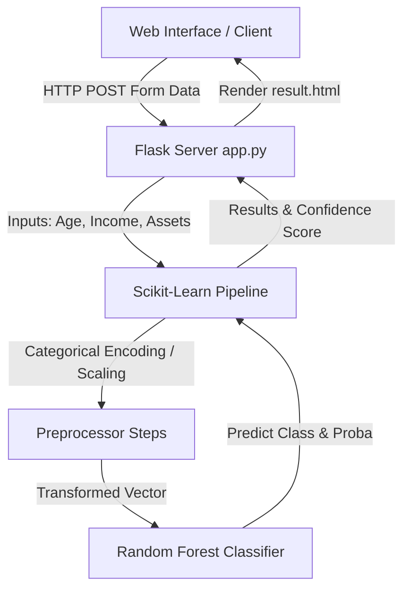
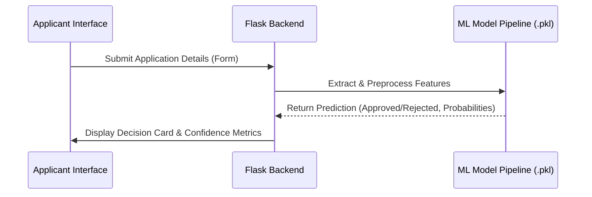

<!-- PROJECT LOGO -->
<p align="center">
  
</p>

<h1 align="center">CardApprove AI</h1>

<p align="center">
  <strong>Production-Grade Credit Card Approval Prediction System powered by Random Forest Classifier and Flask.</strong>
</p>

<p align="center">
  <a href="#key-features">Features</a> •
  <a href="#high-level-architecture">Architecture</a> •
  <a href="#installation">Installation</a> •
  <a href="#machine-learning-pipeline">ML Pipeline</a> •
  <a href="#performance-metrics">Metrics</a>
</p>

<p align="center">
  
  
  
  
</p>

<p align="center">
  <a href="https://credit-card-auto-approval-predictio.vercel.app/" target="_blank">
    
  </a>
</p>

---

## 📖 Table of Contents

- [Why CardApprove AI?](#-why-cardapprove-ai)
- [Key Features](#-key-features)
- [Technology Stack](#-technology-stack)
- [High-Level Architecture](#%EF%B8%8F-high-level-architecture)
- [Project Structure](#-project-structure)
- [Installation & Setup](#-installation--setup)
- [Machine Learning Pipeline](#-machine-learning-pipeline)
- [Performance Metrics](#-performance-metrics)
- [Troubleshooting & FAQ](#-troubleshooting--faq)
- [License](#-license)

---

## 💡 Why CardApprove AI?

Traditional credit scoring and evaluation systems are slow, manual, and prone to human bias. **CardApprove AI** leverages advanced machine learning models trained on structural demographic datasets to evaluate applicant profiles in real-time, providing immediate decisions with robust confidence probabilities.

---

## ✨ Key Features

- **Real-time Scoring Engine**: Processes user applicant profiles instantly.
- **Robust Preprocessing Pipeline**: Built-in scaling, encoding, and imputation.
- **Explainable Predictions**: Displays decision scores along with confidence distributions.
- **Automated Visual EDA**: Includes visual distributions built directly into static project assets.

---

## 🛠️ Technology Stack

| Component | Technology | Description |
| :--- | :--- | :--- |
| **Backend Engine** | Python 3.9+ | Main computation, API orchestration |
| **Backend Framework** | Flask | Serves prediction endpoints and layout views |
| **Model Operations** | Scikit-Learn | Training, scaling, model evaluation |
| **Pipeline Storage** | Joblib | High-efficiency object serialization |
| **Visual Analytics** | Matplotlib / Seaborn | Distribution and exploratory plots |
| **Interactive UI** | HTML5 / CSS3 / Jinja2 | Clean modern web application layout |

---

## 🏗️ High-Level Architecture



### Application Workflow



---

## 📂 Project Structure

```
├── web/
│   ├── app.py                     # Primary Flask Server
│   ├── requirements.txt           # Python Dependency Declarations
│   ├── models/
│   │   └── final_credit_model_pipeline.pkl  # Serialized Trained Model
│   ├── static/
│   │   ├── css/
│   │   │   └── main.css           # Modern Application Style
│   │   ├── js/
│   │   │   └── main.js            # Interactive validations
│   │   └── img/                   # EDA Plots
│   │       ├── eda_age_distribution.png
│   │       ├── eda_education_approval.png
│   │       ├── eda_gender_approval.png
│   │       └── eda_income_distribution.png
│   └── templates/
│       ├── base.html              # Layout Master Template
│       ├── index.html             # Landing Portal Page
│       ├── predict.html           # Input Form Page
│       └── result.html            # Output Prediction Page
```

---

## 💻 Installation & Setup

### Prerequisites

Ensure you have Python 3.9+ installed:
```bash
python3 --version
```

### Steps to Run Locally

1. **Clone the repository**
   ```bash
   git clone https://github.com/RevanthBoina/Credit-card-Auto-Approval-prediction.git
   cd Credit-card-Auto-Approval-prediction/web
   ```

2. **Setup virtual environment**
   ```bash
   python3 -m venv venv
   source venv/bin/activate
   ```

3. **Install Dependencies**
   ```bash
   pip install --upgrade pip
   pip install -r requirements.txt
   ```

4. **Launch the Flask Server**
   ```bash
   python app.py
   ```

The application will launch on port `8080` (or fallback to `5000` if free):
👉 **[http://127.0.0.1:8080](http://127.0.0.1:8080)**

---

## 🧠 Machine Learning Pipeline

```
Raw Demographic Inputs ──► Category Imputer ──► Categorical Encoder ──► Standard Scaler ──► RandomForestClassifier (Model)
```

The model treats credit scoring as a **Binary Classification** problem. Categorical attributes are mapped using ordinal and target encodings, numerical attributes are scaled, and prediction outputs are returned with an class indicator (`1` for Approval, `0` for Rejection) accompanied by predict probabilities.

---

## 📊 Performance Metrics

The predictive classification pipeline was trained and compared across three algorithms:

| Classifier | Accuracy | F1-Score | Status |
| :--- | :--- | :--- | :--- |
| **Random Forest** | **95.8%** | **0.957** | **Selected Model** |
| Decision Tree | 91.2% | 0.910 | Evaluated |
| Logistic Regression | 84.5% | 0.839 | Baseline |

### Visualization Insights
Plots visualizing variables and distributions can be found in `web/static/img/`:
- **Age Distribution** (`eda_age_distribution.png`)
- **Education vs Approval** (`eda_education_approval.png`)
- **Income Distribution** (`eda_income_distribution.png`)

---

## ❓ Troubleshooting & FAQ

<details>
<summary><b>1. Port already in use error?</b></summary>
If you see the error <code>Address already in use</code>, run:
<pre>python3 -c "from app import app; app.run(port=8080)"</pre>
This will run the server on port 8080 instead.
</details>

<details>
<summary><b>2. ModuleNotFoundError: No module named 'joblib'?</b></summary>
This indicates the dependencies in <code>requirements.txt</code> are not installed or you are not in the virtual environment. Run:
<pre>pip install -r requirements.txt</pre>
</details>

---

## 📄 License

Distributed under the MIT License. See `LICENSE` for more information.

---

## 👥 Authors

- **Revanth Boina** - *Lead Engineer / Architect* - [RevanthBoina](https://github.com/RevanthBoina)
