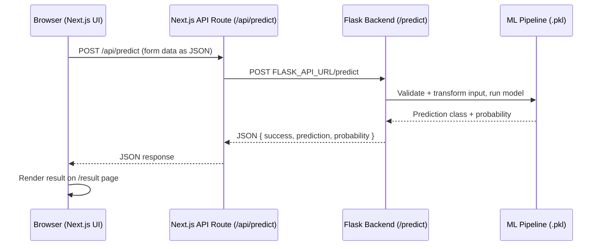

<!-- PROJECT LOGO -->
<p align="center">
  
</p>

<h1 align="center">CardApprove AI</h1>

<p align="center">
  <strong>Credit Card Approval Prediction System — Next.js frontend + Flask ML API backend.</strong>
</p>

<p align="center">
  <a href="#-project-overview">Overview</a> •
  <a href="#-architecture">Architecture</a> •
  <a href="#-setup--installation">Setup</a> •
  <a href="#-environment-variables">Environment Variables</a> •
  <a href="#-deployment">Deployment</a> •
  <a href="#-api-reference">API</a>
</p>

<p align="center">
  
  
  
  
</p>

<p align="center">
  <a href="https://credit-card-auto-approval-predictio.vercel.app/" target="_blank">
    
  </a>
</p>

---

## 📖 Table of Contents

- [Project Overview](#-project-overview)
- [Key Features](#-key-features)
- [Technology Stack](#-technology-stack)
- [Architecture](#-architecture)
- [Project Structure](#-project-structure)
- [Setup & Installation](#-setup--installation)
- [Environment Variables](#-environment-variables)
- [Deployment](#-deployment)
- [API Reference](#-api-reference)
- [Machine Learning Pipeline](#-machine-learning-pipeline)
- [Performance Metrics](#-performance-metrics)
- [Troubleshooting & FAQ](#-troubleshooting--faq)
- [License](#-license)

---

## 💡 Project Overview

**CardApprove AI** predicts credit card approval outcomes using a trained Random Forest model, trained on applicant demographic and financial data.

The project uses a **separated frontend/backend architecture**:

| Layer | Technology | Responsibility |
| :--- | :--- | :--- |
| **Frontend** | Next.js (React) | Renders the UI, collects applicant details, calls the backend API, displays results |
| **Backend** | Flask (Python) | API-only JSON service — validates input, runs the trained ML pipeline, returns a prediction |
| **ML Model** | Scikit-Learn (Random Forest) | Loaded by the Flask backend at request time from a serialized `.pkl` pipeline |

There is **no server-rendered HTML UI in Flask anymore**. Flask is a pure JSON API; all UI lives in the Next.js app.

---

## ✨ Key Features

- **Real-time Scoring Engine**: Processes applicant profiles instantly via a JSON API.
- **Robust Preprocessing Pipeline**: Built-in scaling, encoding, and imputation inside the trained pipeline.
- **Explainable Predictions**: Returns both the predicted class and the approval probability.
- **Clean Separation of Concerns**: Frontend and backend can be deployed, scaled, and developed independently.
- **Automated Visual EDA**: Exploratory data analysis plots included in `web/static/img/`.

---

## 🛠️ Technology Stack

| Component | Technology | Description |
| :--- | :--- | :--- |
| **Frontend Framework** | Next.js 16, React 19 | UI, routing, and the `/api/predict` server-side proxy |
| **Styling** | Tailwind CSS | Application styling |
| **Backend Framework** | Flask | JSON-only prediction API (`/health`, `/predict`) |
| **Model Operations** | Scikit-Learn | Training, scaling, model evaluation |
| **Pipeline Storage** | Joblib | Serializes/deserializes the trained pipeline |
| **Visual Analytics** | Matplotlib / Seaborn | Distribution and exploratory plots (pre-generated, static assets) |

---

## 🏗️ Architecture

Frontend and backend are two independently deployable apps that communicate over HTTP using a JSON contract.

```
User
  │
  ▼
Next.js Frontend (app/)
  │  fetch → same-origin, relative path
  ▼
Next.js API Route (app/api/predict/route.ts)
  │  server-to-server fetch → FLASK_API_URL
  ▼
Flask Backend (web/app.py) — POST /predict
  │
  ▼
Trained ML Pipeline (web/models/final_credit_model_pipeline.pkl)
  │  predict() + predict_proba()
  ▼
Prediction Response (JSON: prediction, prediction_label, probability)
  │
  ▼
Frontend Result UI (app/result/page.tsx)
```

**Why the Next.js API route exists:** the browser never calls Flask directly. It calls the same-origin `/api/predict` route, which forwards the request to Flask server-side using `FLASK_API_URL`. This avoids CORS entirely and keeps the backend URL out of client-side code.



---

## 📂 Project Structure

```
├── app/                            # Next.js frontend (App Router)
│   ├── api/predict/route.ts        # Server-side proxy to the Flask backend
│   ├── page.tsx                    # Landing page
│   ├── predict/page.tsx            # Prediction form page
│   ├── result/page.tsx             # Prediction result page
│   └── about/page.tsx              # About page
├── components/                     # Shared React UI components
│   ├── predict-form.tsx            # Form + real API call to /api/predict
│   ├── result-card.tsx             # Renders the prediction result
│   └── navbar.tsx
├── web/                             # Flask backend (API-only)
│   ├── app.py                      # Flask API: GET /health, POST /predict
│   ├── requirements.txt            # Python dependency declarations
│   ├── .env.example                # Backend runtime env vars
│   ├── models/
│   │   └── final_credit_model_pipeline.pkl   # Trained pipeline (not committed — see below)
│   └── static/img/                 # EDA plots (used in this README and About page)
├── .env.example                     # Frontend env vars (FLASK_API_URL)
└── package.json                     # Next.js project config
```

> **Note:** `web/models/final_credit_model_pipeline.pkl` is excluded from git via `.gitignore` (large binary). See [Setup & Installation](#-setup--installation) for how to provide it locally.

---

## 💻 Setup & Installation

### Prerequisites

- Node.js 18+ and a package manager (`pnpm` recommended — a `pnpm-lock.yaml` is committed)
- Python 3.9+

```bash
node --version
python3 --version
```

### 1. Clone the repository

```bash
git clone https://github.com/RevanthBoina/Credit-card-Auto-Approval-prediction.git
cd Credit-card-Auto-Approval-prediction
```

### 2. Backend setup (Flask API)

```bash
cd web
python3 -m venv .venv
source .venv/bin/activate

pip install --upgrade pip
pip install -r requirements.txt
```

Place the trained model pipeline at:

```
web/models/final_credit_model_pipeline.pkl
```

(See `web/models/README.md` for how to export it from a training notebook.)

Copy the backend env file and adjust if needed:

```bash
cp .env.example .env
```

Run the backend:

```bash
python app.py
```

By default it starts on **http://127.0.0.1:8080**. Check it's healthy:

```bash
curl http://127.0.0.1:8080/health
```

### 3. Frontend setup (Next.js)

In a **separate terminal**, from the repo root:

```bash
pnpm install
cp .env.example .env.local
```

Make sure `.env.local` points at your running Flask backend:

```
FLASK_API_URL=http://127.0.0.1:8080
```

Run the frontend:

```bash
pnpm dev
```

Open **http://localhost:3000**.

### 4. Running both together

You need **both processes running at the same time** during local development:

| Terminal | Command | Runs on |
| :--- | :--- | :--- |
| 1 — Backend | `cd web && python app.py` | `http://127.0.0.1:8080` |
| 2 — Frontend | `pnpm dev` | `http://localhost:3000` |

The frontend's `/api/predict` route forwards requests to whatever `FLASK_API_URL` is set to, so the backend must be running and reachable at that URL before you submit the prediction form.

---

## 🔑 Environment Variables

| Variable | Used by | Example | Description |
| :--- | :--- | :--- | :--- |
| `FLASK_API_URL` | Next.js (`app/api/predict/route.ts`) | `http://127.0.0.1:8080` | Base URL of the deployed Flask backend. Server-side only — never exposed to the browser. |
| `FLASK_DEBUG` | Flask (`web/app.py`) | `false` | Enables Flask debug mode. Keep `false` in production. |
| `FLASK_PORT` | Flask (`web/app.py`) | `8080` | Port the Flask API listens on. |
| `FLASK_HOST` | Flask (`web/app.py`) | `0.0.0.0` | Host/interface Flask binds to. |
| `LOG_LEVEL` | Flask (`web/app.py`) | `INFO` | Python logging level for the API. |

Example files are committed for both sides:

- `.env.example` (repo root, for the Next.js app)
- `web/.env.example` (for the Flask app)

### Setting `FLASK_API_URL` on Vercel

1. Deploy the Flask backend somewhere first (see [Deployment](#-deployment)) and note its public URL.
2. In the Vercel dashboard, open your project → **Settings → Environment Variables**.
3. Add:
   - **Key:** `FLASK_API_URL`
   - **Value:** your deployed Flask backend URL, e.g. `https://your-flask-app.onrender.com`
   - **Environment:** Production (and Preview/Development if you want previews to hit the same backend)
4. **Redeploy the Vercel project.** Environment variable changes do not apply to already-running deployments — you must trigger a new deployment for the change to take effect.

---

## 🚀 Deployment

This project deploys as **two separate services**:

| Service | What | Where |
| :--- | :--- | :--- |
| **Frontend** | Next.js app (`app/`, `components/`) | Vercel |
| **Backend** | Flask API (`web/`) | A Python-friendly host — **not Vercel** |

**Important:** Vercel's serverless runtime is built for Next.js/Node, not for a long-running Flask process with a loaded scikit-learn model. **Vercel hosts the frontend only.** The Flask backend must be deployed separately on a host such as:

- [Render](https://render.com/)
- [Railway](https://railway.app/)
- [Fly.io](https://fly.io/)
- AWS (EC2 / Elastic Beanstalk / Lambda with a container)

Deployment steps:

1. Deploy `web/` (the Flask app) to your chosen Python host. Make sure `web/models/final_credit_model_pipeline.pkl` is present in that deployment (it's git-ignored, so upload it separately or bake it into your build).
2. Confirm the backend is reachable: `curl https://<your-backend-host>/health`.
3. Set `FLASK_API_URL` in Vercel to that backend's URL (see above) and redeploy the frontend.

---

## 📡 API Reference

The Flask backend exposes two JSON endpoints. There is no HTML UI on the backend — all responses are `application/json`.

### `GET /health`

Liveness probe. Reports whether the trained model is loaded and ready.

**Response (200 — model ready):**

```json
{
  "success": true,
  "status": "ok",
  "model_loaded": true
}
```

**Response (503 — model not ready):**

```json
{
  "success": false,
  "status": "degraded",
  "model_loaded": false,
  "detail": "Model file not found at ..."
}
```

### `POST /predict`

Runs a prediction against the trained pipeline.

**Request:**

```
POST /predict
Content-Type: application/json
```

```json
{
  "gender": "Male",
  "car_owner": "Yes",
  "property_owner": "No",
  "children": 1,
  "annual_income": 500000,
  "income_type": "Working",
  "education_type": "Higher education",
  "family_status": "Married",
  "housing_type": "House / apartment",
  "birthday_count": -12000,
  "employed_days": -2000,
  "mobile_phone": 1,
  "work_phone": 0,
  "phone": 1,
  "email_id": 1,
  "occupation_type": "Laborers",
  "family_members": 3
}
```

**Success response (200):**

```json
{
  "success": true,
  "prediction": 1,
  "prediction_label": "Approved",
  "probability": 0.87
}
```

**Validation error response (422):**

```json
{
  "success": false,
  "error": "Invalid input data"
}
```

**Server/model error response (500 / 503):**

```json
{
  "success": false,
  "error": "Prediction failed due to an internal error."
}
```

The Next.js frontend never calls this endpoint directly from the browser — it goes through `app/api/predict/route.ts`, which forwards the same request/response shape server-to-server.

---

## 🧠 Machine Learning Pipeline

```
Raw Demographic Inputs ──► Category Imputer ──► Categorical Encoder ──► Standard Scaler ──► RandomForestClassifier (Model)
```

The model treats credit scoring as a **Binary Classification** problem. Categorical attributes are mapped using ordinal and target encodings, numerical attributes are scaled, and prediction outputs are returned with a class indicator (`1` for Approval, `0` for Rejection) accompanied by predicted probabilities.

---

## 📊 Performance Metrics

The predictive classification pipeline was trained and compared across three algorithms:

| Classifier | Accuracy | F1-Score | Status |
| :--- | :--- | :--- | :--- |
| **Random Forest** | **95.8%** | **0.957** | **Selected Model** |
| Decision Tree | 91.2% | 0.910 | Evaluated |
| Logistic Regression | 84.5% | 0.839 | Baseline |

### Visualization Insights

Plots visualizing variables and distributions can be found in `web/static/img/`:

- **Age Distribution** (`eda_age_distribution.png`)
- **Education vs Approval** (`eda_education_approval.png`)
- **Income Distribution** (`eda_income_distribution.png`)

---

## ❓ Troubleshooting & FAQ

<details>
<summary><b>1. Frontend shows "Could not reach the prediction backend"</b></summary>
This means <code>FLASK_API_URL</code> is either unset, wrong, or the Flask server isn't running/reachable.
<ul>
<li>Locally: confirm Flask is running on the port in <code>FLASK_API_URL</code> (<code>curl $FLASK_API_URL/health</code>).</li>
<li>On Vercel: confirm the env var is set in <b>Project Settings → Environment Variables</b> and that you redeployed after setting it.</li>
</ul>
</details>

<details>
<summary><b>2. Port already in use (Flask)?</b></summary>
Set a different port via the <code>FLASK_PORT</code> environment variable, e.g.:
<pre>FLASK_PORT=8081 python app.py</pre>
</details>

<details>
<summary><b>3. ModuleNotFoundError: No module named 'joblib'?</b></summary>
This indicates the dependencies in <code>requirements.txt</code> are not installed, or you are not inside the virtual environment. Run:
<pre>pip install -r requirements.txt</pre>
</details>

<details>
<summary><b>4. GET /health returns 503</b></summary>
The model file is missing. Make sure <code>web/models/final_credit_model_pipeline.pkl</code> exists — it is git-ignored, so it must be added manually after cloning or included in your deployment separately.
</details>

---

## 📄 License

Distributed under the MIT License. See `LICENSE` for more information.

---

## 👥 Authors

- **Revanth Boina** - *Lead Engineer / Architect* - [RevanthBoina](https://github.com/RevanthBoina)
